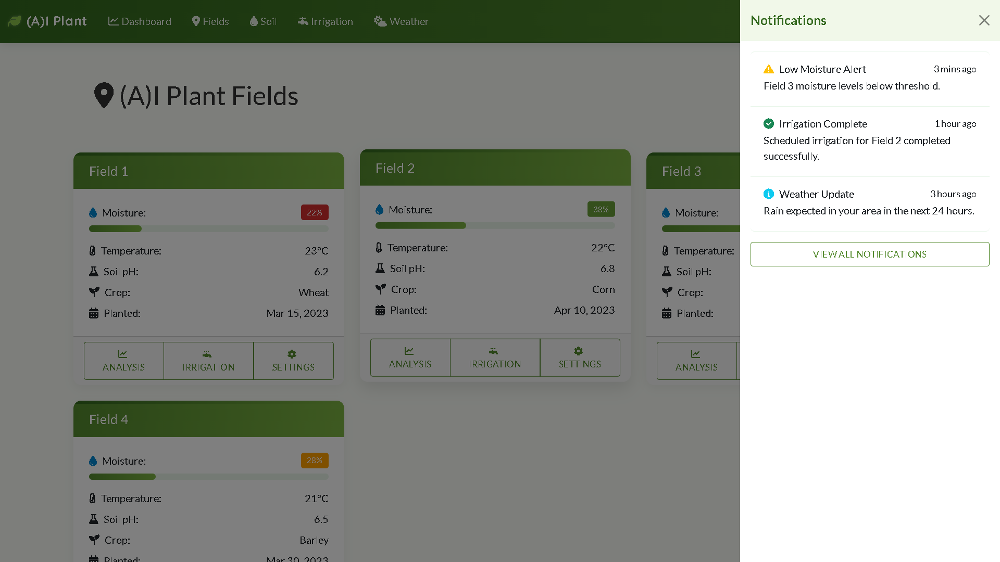

# A-I Plant - AI-Powered Agriculture Monitoring System 

## Overview

A-I Plant is an intelligent agriculture monitoring system that leverages artificial intelligence to provide real-time soil analysis, nutrient monitoring, and farming recommendations. The platform helps farmers optimize their agricultural practices by offering detailed insights into soil quality, moisture levels, pH balance, and nutrient content across multiple fields.

While A-I Plant integrates machine learning models for soil quality prediction and recommendation generation, much of the current functionality operates as a simulation to demonstrate the intended AI capabilities. Full integration with live sensor data and real-time AI-driven analysis is planned for future development.

## Key Features

.png)

- Monitor soil quality metrics including texture, structure, drainage, and organic matter content
- Track essential nutrients like nitrogen, phosphorus, potassium, calcium, magnesium, and sulfur
- Real-time soil moisture data with alerts for optimal irrigation timing
- Monitor and track soil pH levels for optimal crop growth
- AI-generated recommendations for fertilizer application and soil improvement
- Manage multiple fields with individual monitoring and recommendations
- Weather forecasts and historical data to inform farming decisions
- Automated irrigation scheduling based on soil moisture and weather forecasts

## Screenshots

### Soil Analysis Dashboard

### Nutrient Monitoring

### Field Management

### Irrigation Control

### Weather Forecasting

### AI Recommendations

## Technology Stack

### Frontend
- **HTML5/CSS3**
- **Bootstrap 5.3**
- **JavaScript**
- **Chart.js**
- **Font Awesome**
- **Custom CSS Animations**
- 
### Backend
- **Python**
- **Flask**
- **SQLite**
- **SQLAlchemy**

### APIs & Services
- **Agrimetrics API**
- **IoT Service**
- **Weather API**

### Data Analysis
- **Pandas**
- **NumPy**
- **Machine Learning Models**

### Development Tools
- **Git**
- **Flask-SQLAlchemy**
- **Flask-Login**
- **Flask-WTF**

## Future Enhancements

- Mobile application for on-field monitoring
- Integration with drone imagery for crop health analysis
- Advanced predictive analytics for crop yield forecasting
- Blockchain integration for supply chain transparency
- Community features for knowledge sharing among farmers

